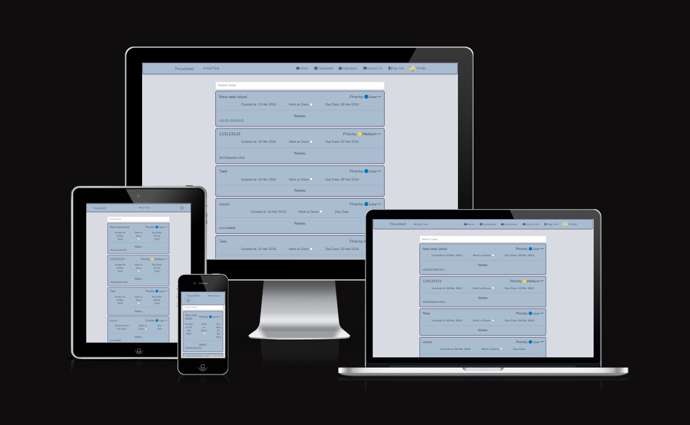
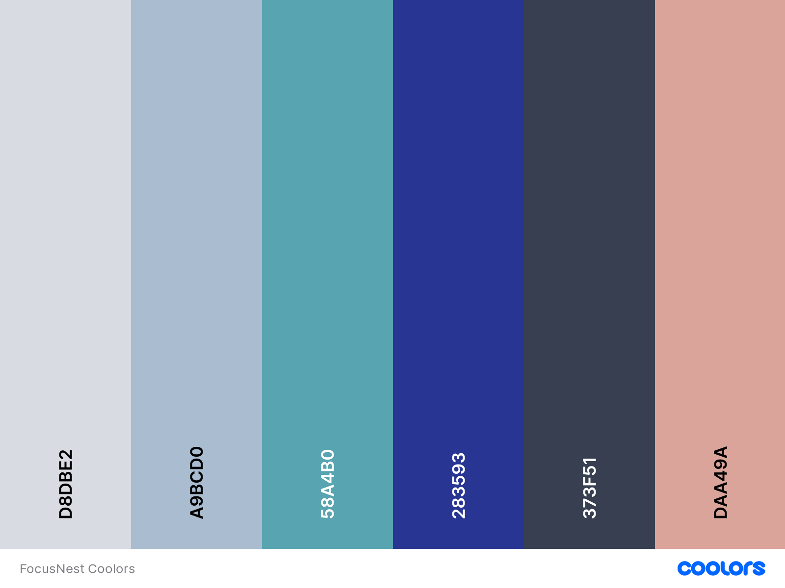

# Focus Nest App

This is my fifth milestone project for the Code Institute Full Stack Web Development Course. The objective of this project is to develop a Full-Stack web application using Django (DRF) for the backend and React for the frontend.

Focus Nest aims to enhance user productivity by providing a comprehensive tool for managing tasks and goals, offering the ability to organize tasks into 'collections' for better grouping.

- [Deployed Frontend](https://focus-nest-1f84ad6cf300.herokuapp.com/)
- [Deployed Backend](https://focus-nest-api-a8aee1208ee3.herokuapp.com/)

## UX

The focus was on creating a calming, easy-to- use and intuitive user interface. Navigation is made intuitive, with the navbar accessible at all times aswell as animated buttons, dropdowns and hyperlinks. On smaller screens, it collapses to avoid interference with other UI elements.

### Design

When desinging the app, the goal was to create a calming, easy-to-use internace.The color palette is sublte and is consistent through-out the app, promoting a sense of tranquility.
For styling the React Bootstrap was used, with additional custom styles added to align with the overall vision of the website.

### Color palette

### Typography

Nunito is this project's font. It's a sans-serif typeface designes by Vernon Adams. It's rounded letterforms give it a warm and friendly feeling, which nicely harmonizes with the calm color palette of the app.

### User Sories

For detailed user stories, please visit the [Kanbar Board](https://github.com/users/KarolSU96/projects/3) of the project.

## Features

Focus Nest offers a user-friendly task management experience. Users can manage tasks comprehensively, with access to profile statistics and the ability to customize their profile image. The app provides full CRUD functionality for tasks and collections, with both easily searchable through the search bar. Users can also contact the admin for additional help or provide feedback for improvements.

## Future Features

Won't have stories described here.

## Components

Document theresuable components and their function.Explain that I reused the css for cards. Can refactor this styles in the future for better naming

### Navbar

Navbar is a navigation componant that displays the icons that when clicked, forward the user to the different pages. It logged in and logged out users see different navbar layout. From navbar user can also add new tasks - which enables him addid tasks from every page of the website. Navbar is used in every page of the website.

### Avatar

Avatar is user profile image component that is displayed inside the Navbar component.

### DotsDropdown

Three dots dropdown compoenent. In this project it provides the edit and delete dropdown buttons.

### LoadingSpinner

Loading spinner displays before the data is fetched on the pages, aswell as during the use of the searchbar.

### PageNotFound

Informs user that he laded on a unknown url.

### SignUpForm

Users can register there and are welcomed with a encouraging image.

### SignInForm

Page where users can log in with their credentials.

### Task

Core component of the app. Users can delete and edit task based on it's id.
The user can add Task's:

- Title
- Priotiry- the user can chooose between: low, medium, high
- Mark as done Checkbox
- Due Date
- Notes

The Task component is used inside:

- Task Create Form this where the Tasks are crated
- Home / Tasks Page, which is where all of the tasks that are not completed are listed inside of the infinite scroll element.
- Task Edit Form page component that encorporated Task which takes the task by the ID and enables it's edit.
- Task Detail Page - this page is used to display the single tasks. It is not accessible through the ui, because the user sees every detail of the task inside of the HomeTasksPage, can be accessed by the url modification. Useful for admins whenever he would like to check how the actual task look like outside of the admin panel.

### Collection

Collection component enables users to group the tasks together.
The users can add Collection's:

- Title
- Due date
- Description
- Tasks

The Collection component is used inside:

- Collection Create Form- where user can create new collection
- Collections Page- where all of the collections are listed
- Collection Detail Page- collection details and all of collection's taks are listed inside a infinite loop
- Collection Edit Form- where users can edit the collection details

### Profile

Profile is a page component. There was not point in creating a modular one for this model, because there is only one page that displays it and second, edit form which would not benefit from use of modular component.
Here the user can change the profile image and add his/hers goals.

### Contact Form

Contact form displays for every user, whether someone is logged in or not. The users can contact the admin / crew of the site for support/ improvement ideas/ report any bugs.

## Bugs and Errors

Explain the problems that I encountered and that I still encounter.

## Technologies used

- React
- React DOM: Gives access to DOM methods that can be used at top level of the app to render the components.
- React Router DOM: Enables routing for React applications.
- React Bootstrap: UI framework for React applications.
- React Infinite Scroll Component: A React compontnt for infinite scrolling (tasks, collections).
- Axios: A promise-based HTTP client.
- Date-fns: A date utility library.
- JWT Decode: A library to decode JWT tokens
- ESLint: JavaScript code quality checker

### Enviroment

- Node: v20.10.0
- npm: v10.2.3

## Testing

| Test Case                            | Expected                                                                                      | Testing                                                                                                                                                | Results                                                                           |
| ------------------------------------ | --------------------------------------------------------------------------------------------- | ------------------------------------------------------------------------------------------------------------------------------------------------------ | --------------------------------------------------------------------------------- |
| \*\*Authentication\*\*               |                                                                                               |                                                                                                                                                        |                                                                                   |
| Create a new user                    | User profile is created successfully.                                                         | Created a new user profile.                                                                                                                            | User profile created as expected.                                                 |
| SignUp wrong password                | User is prompted and the profile is not not registered if password is not repeated correctly. |                                                                                                                                                        | User prompted correctly.                                                          |
| SignIn wrong password                | User is prompted and the profile is not not registered if password is not repeated correctly. |                                                                                                                                                        | User prompted correctly.                                                          |
|                                      |                                                                                               |                                                                                                                                                        |                                                                                   |
| \*\*Profile\*\*                      |                                                                                               |                                                                                                                                                        |                                                                                   |
| Edit profile page                    | Profile edit form updates the current profile.                                                | Used edit form to edit the profile.                                                                                                                    | Edition of profile details as expected.                                           |
| Profile details counters             | Profile details get updated when collection or task gets deleted/added.                       | Adding / deleting tasks and collection and going to profile page to check the difference.                                                              | Profile updates the statistics as expected.                                       |
| Image Change                         | Profile image updates after changing it in.                                                   | \-Go to "Profile" in navbar. \-Click on "Edit Profile" button \-Upload a new image \-Click save                                               | Profile image updated as expected.                                                |
|                                      |                                                                                               |                                                                                                                                                        |                                                                                   |
| \*\*Tasks\*\*                        |                                                                                               |                                                                                                                                                        |                                                                                   |
| Create a new task                    | Task is created successfully                                                                  | \-Clicked on the "Add task" button. \-Filled out the form. \-Saved the form.                                                                     | Task created as expected.                                                         |
| Add task missing required fields     | Task creation should be stopped and user prompted.                                            | \-Click on dropdown edit button of the task.                                                                                                           | User successfully prompted.                                                       |
| Edit an existing task                | Task is updated successfully.                                                                 | \-Click on edit button inside task's dropdown. \-Change task data. \-Click on save.                                                              | Task updated as expected.                                                         |
| Infinite scroll; tasks loading       | Infinite scroll loads every task.                                                             | Add over 10 tasks and go to home task page.                                                                                                            | Infinite scroll works as expected.                                                |
| Mark task as done                    | Marked Task should appear in "Completed" page.                                                | \-In Home Page \-Mark a task as done. \-Go to "Completed" page to check if it appeared there.                                                    | Task appears in "Completed" as expected.                                          |
| Unmark task as done                  | Task with unmarked done checkbox should appear back in the "Home Task Page".                  | \-Go to the "Completed" page \-Unmark the checkbox \-Go to "Home" page to check if the task appeared back in the infinite scroll                 | Task appears back in the "Home" page                                              |
| Delete Task                          | Task is deleted successfully and doesn't appear in the collection..                           | \-In the Task page, click on dropdown delete button.                                                                                                   | The task doesn't appear on "Tasks" page and inside collection it was assigned to. |
|                                      |                                                                                               |                                                                                                                                                        |                                                                                   |
| \*\*Collections\*\*                  |                                                                                               |                                                                                                                                                        |                                                                                   |
| Create a new collection              | Collection is created successfully.                                                           | \-Go to collections. \-Click on "Add Collection" button. \-Fill out the form. \-Click save.                                                   | Collection added successfully.                                                    |
| Edit collection                      | Collection is updated successfully.                                                           | \-Click on collection. \-Click on edit dropdown button of a collection, inside collection detail page. \-Make changes. \-Hit the save button. | Collection updated successfully.                                                  |
| Infinite scroll; collections loading | Infinite scroll load every collection.                                                        | Add over 10 collections and go to collections page.                                                                                                    | Infinite scroll works as expected.                                                |
| Delete collection                    | Collection is deleted successfully.                                                           | \-On "Collections" page go to collection. \-Click on delete dropdown button.                                                                     | Collection deleted successfully.                                                  |
|                                      |                                                                                               |                                                                                                                                                        |                                                                                   |
| \*\*Navbar\*\*                       |                                                                                               |                                                                                                                                                        |                                                                                   |
| Navbar icon change for logged in     | Logged in user sees tasks, completed, collection and profile icons inside of the navbar.      | Log in with credentials, check the navbar.                                                                                                             | Navbar changes the icons successfully.                                            |
| Sign Out                             | User is signed out after clicking "Sign Out" button.                                          | Click on sign out button as a logged in user.                                                                                                          | User logs out successfully.                                                       |
|                                      |                                                                                               |                                                                                                                                                        |                                                                                   |
| \*\*Contact Form\*\*                 |                                                                                               |                                                                                                                                                        |                                                                                   |
| Contact form working                 | Contact form appears in admin panel.                                                          | \-Fill out contact form fields. \-Check the admin panel.                                                                                            | Contact form appears in the admin page.                                           |

## Acknowledgments
I would like to thank:
- My mentor, [Lauren-Nicole](https://github.com/CluelessBiker) for her support and enrouragement throughout the development of this project.
- Code Insitute tutor team for their help and assistance with debugging some of the project bugs.
- Conde Institute for the UseClickOutSideToggle function and CurrentUserContext.
- [Am I Responsive](https://ui.dev/amiresponsive) for providing a useful, easy to use, website responsiveness visualisation tool.
- [PGBS](https://www.proglobalbusinesssolutions.com/css-hover-effects/) and [Dev.to](https://dev.to/kiranrajvjd/12-simple-css-hover-effects-95d) for inspiration for the CSS hover effects.
- [SevemStorm](https://www.pexels.com/@sevenstormphotography/) from Pexels for the sign in image 