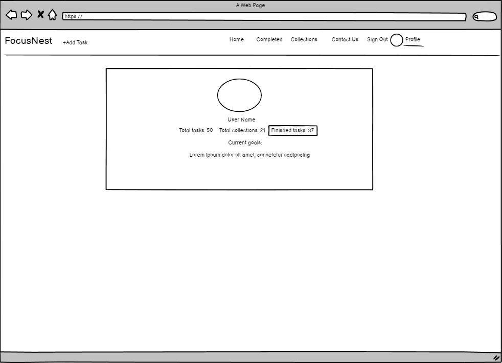

# Focus Nest App

This is my fifth milestone project for the Code Institute Full Stack Web Development Course. The objective of this project is to develop a Full-Stack web application using Django (DRF) for the Backend and React for the Frontend.

Focus Nest aims to enhance user productivity by providing a comprehensive tool for managing tasks and goals, offering the ability to organize tasks into 'collections' for better grouping.

- [Deployed Frontend](https://focus-nest-1f84ad6cf300.herokuapp.com/)
- [Deployed Backend](https://focus-nest-api-a8aee1208ee3.herokuapp.com/)

## UX

The focus was on creating a calming, easy-to-use, and intuitive user interface. Navigation is made intuitive, with the navbar accessible at all times as well as animated buttons, dropdowns, and hyperlinks. On smaller screens, it collapses to avoid interference with other UI elements.

### Design

When designing the app, the goal was to create a calming, easy-to-use interface. The color palette is subtle and consistent throughout the app, promoting a sense of tranquility.
For styling the React Bootstrap was used, with additional custom styles added to align with the overall vision of the website.

### Wireframes

* Sign-in page

* Sign-up page

* Home page + Collection Page have almost the same layout. With the difference that the dropdown menu for the collection appears only on the Collection Detail Page.

* Completed tasks page

* Add task form

* Task edit form

* Collection details page

* Add collection form

* Collection edit form

* Contact form 

* Profile page 

* Profile edit 

### Color palette

### Typography

Nunito is this project's font. It's a sans-serif typeface designed by Vernon Adams. Its rounded letterforms give it a warm and friendly feeling, which nicely harmonizes with the calm color palette of the app.

### User Stories

For detailed user stories, please visit the [Kanbar Board](https://github.com/users/KarolSU96/projects/3) of the project.

## Features

Focus Nest offers a user-friendly task management experience. Users can manage tasks comprehensively, with access to profile statistics and the ability to customize their profile image. The app provides full CRUD functionality for tasks and collections, with both easily searchable through the search bar. Users can also contact the admin for additional help or provide feedback for improvements.

## Future Features

In the future, I would like to add filters to the tasks and collections. The user would be able to search them by the date.
I would also like to improve the tasks by allowing them to store images/files. 

## Components

### Navbar

The navbar is a navigation component that displays the icons that when clicked, forward the user to the different pages. Logged-in and logged-out users see different navbar layouts. From the navbar, the user can also add new tasks - which enables him to add tasks from every page of the website. The Navbar is used on every page of the website.

### Avatar

Avatar is a user profile image component that is displayed inside the Navbar component.

### Dots Dropdown

Offers edit and delete dropdown buttons for enhanced user interaction.

### Loading Spinner

Loading spinner displays before the data is fetched on the pages, as well as during the use of the searchbar.

### Page Not Found

Informs the user that he landed on an unknown URL.

### Sign Up Form

Users can register there and are welcomed with an encouraging image.

### Sign In Form

The page where users can log in with their credentials.

### Task

Core component of the app. Users can delete and edit a task based on its id.
The user can add Tasks:

- Title
- Priority- the user can choose between low, medium, high
- Mark as done Checkbox
- Due Date
- Notes

The Task component is used inside:

- Task Create Form is where the Tasks are created
- Home / Tasks Page, which is where all of the tasks that are not completed are listed inside of the infinite scroll element.
- Task Edit Form page component that incorporated Task which takes the task by the ID and enables its edit.
- Task Detail Page - this page is used to display the single tasks. It is not accessible through the UI, because the user sees every detail of the task inside of the HomeTasksPage, which can be accessed by the URL modification. Useful for admins whenever they would like to check what the actual task looks like outside of the admin panel.

### Collection

The collection component enables users to group the tasks.
The users can add Collection:

- Title
- Due date
- Description
- Tasks

The Collection component is used inside:

- Collection Create Form- where the user can create a new collection
- Collections Page- where all of the collections are listed
- Collection Detail Page- collection details and all of the collection's tasks are listed inside an infinite loop
- Collection Edit Form- where users can edit the collection details

### Profile

The profile is a page component. There was no point in creating a modular one for this model because there is only one page that displays it, and the second, edit form which would not benefit from the use of modular components.
Here the user can change the profile image and add his/her goals.
The JSX of the component is saved in a variable for easier modification if in the future there is a need to make it more modular.

### Contact Form

Contact form displays for every user, whether someone is logged in or not. The users can contact the admin/crew of the site for support/ improvement ideas/ report any bugs.

### Current User Context 

Manages authentication state and provides current user data to components.

## Bugs and Errors

Explain the problems that I encountered and that I still encounter.

## Technologies used

- React
- React DOM: Gives access to DOM methods that can be used at the top level of the app to render the components.
- React Router DOM: Enables routing for React applications.
- React Bootstrap: UI framework for React applications.
- React Infinite Scroll Component: A React component for infinite scrolling (tasks, collections).
- Axios: A promise-based HTTP client.
- Date-fns: A date utility library.
- JWT Decode: A library to decode JWT tokens
- ESLint: JavaScript code quality checker

### Environment

- Node: v20.10.0
- npm: v10.2.3

## Testing

### ESLint
Every file of the project has been checked with the ESLint and no issues have been found.

### Lighthouse

|                    | Desktop     | Desktop       | Desktop        | Desktop | Mobile      | Mobile        | Mobile         | Mobile |
| ------------------ | ----------- | ------------- | -------------- | ------- | ----------- | ------------- | -------------- | ------ |
| Page               | Performance | Accessibility | Best Practices | SEO     | Performance | Accessibility | Best Practices | SEO    |
|                    |             |               |                |         |             |               |                |        |
| Sign In            | 96          | 100           | 96             | 100     | 70          | 100           | 96             | 100    |
| Sign Up            | 90          | 100           | 74             | 100     | 70          | 100           | 74             | 100    |
| Home (signed-out)  | 96          | 100           | 96             | 100     | 71          | 100           | 96             | 100    |
| Home (signed-in)   | 95          | 94            | 78             | 100     | 67          | 94            | 78             | 100    |
| Task Edit Form     | 97          | 93            | 74             | 100     | 69          | 94            | 74             | 100    |
| Completed          | 97          | 94            | 78             | 100     | 75          | 94            | 78             | 100    |
| Collections        | 97          | 100           | 78             | 100     | 67          | 100           | 78             | 100    |
| Collection Details | 96          | 94            | 78             | 100     | 71          | 94            | 78             | 100    |
| Collection Edit    | 96          | 95            | 78             | 100     | 70          | 94            | 78             | 100    |
| Contact Form       | 97          | 94            | 78             | 100     | 71          | 94            | 74             | 100    |
| Profile            | 92          | 91            | 78             | 91      | 66          | 91            | 78             | 92     |

### Manual Tests

| Test Case                            | Expected                                                                                      | Testing                                                                                                                                                | Results                                                                           |
| ------------------------------------ | --------------------------------------------------------------------------------------------- | ------------------------------------------------------------------------------------------------------------------------------------------------------ | --------------------------------------------------------------------------------- |
| \*\*Authentication\*\*               |                                                                                               |                                                                                                                                                        |                                                                                   |
| Create a new user                    | User profile is created successfully.                                                         | Created a new user profile.                                                                                                                            | User profile created as expected.                                                 |
| SignUp wrong password                | The User is prompted and the profile is not registered if the password is not repeated correctly. |                                                                                                                                                        | User prompted correctly.                                                          |
| SignIn wrong password                | The User is prompted and the profile is not registered if the password is not repeated correctly. |                                                                                                                                                        | User prompted correctly.                                                          |
|                                      |                                                                                               |                                                                                                                                                        |                                                                                   |
| \*\*Profile\*\*                      |                                                                                               |                                                                                                                                                        |                                                                                   |
| Edit profile page                    | Profile edit form updates the current profile.                                                | Used edit form to edit the profile.                                                                                                                    | Edition of profile details as expected.                                           |
| Profile details counters             | Profile details get updated when a collection or task gets deleted/added.                       | Adding/deleting tasks and collections and going to the profile page to check the difference.                                                              | Profile updates the statistics as expected.                                       |
| Image Change                         | Profile image updates after changing it in.                                                   | \-Go to "Profile" in navbar. \-Click on "Edit Profile" button \-Upload a new image \-Click save                                               | Profile image updated as expected.                                                |
|                                      |                                                                                               |                                                                                                                                                        |                                                                                   |
| \*\*Tasks\*\*                        |                                                                                               |                                                                                                                                                        |                                                                                   |
| Create a new task                    | Task is created successfully                                                                  | \-Clicked on the "Add task" button. \-Filled out the form. \-Saved the form.                                                                     | Task created as expected.                                                         |
| Add task missing required fields     | Task creation should be stopped and the user prompted.                                            | \-Click on the dropdown edit button of the task.                                                                                                           | User successfully prompted.                                                       |
| Edit an existing task                | The Task is updated successfully.                                                                 | \-Click on the edit button inside the task's dropdown. \-Change task data. \-Click on save.                                                              | Task updated as expected.                                                         |
| Infinite scroll; tasks loading       | Infinite scroll loads every task.                                                             | Add over 10 tasks and go to the home task page.                                                                                                            | Infinite scroll works as expected.                                                |
| Mark task as done                    | Marked Task should appear on the "Completed" page.                                                | \-In Home Page \-Mark a task as done. \-Go to the "Completed" page to check if it appeared there.                                                    | Task appears in "Completed" as expected.                                          |
| Unmark task as done                  | Task with unmarked done checkbox should appear back in the "Home Task Page".                  | \-Go to the "Completed" page \-Unmark the checkbox \-Go to the "Home" page to check if the task appeared back in the infinite scroll                 | Task appears back in the "Home" page                                              |
| Delete Task                          | Task is deleted successfully and doesn't appear in the collection..                           | \-In the Task page, click on the dropdown delete button.                                                                                                   | The task doesn't appear on the "Tasks" page and inside the collection it was assigned to. |
|                                      |                                                                                               |                                                                                                                                                        |                                                                                   |
| \*\*Collections\*\*                  |                                                                                               |                                                                                                                                                        |                                                                                   |
| Create a new collection              | The Collection is created successfully.                                                           | \-Go to collections. \-Click on "Add Collection" button. \-Fill out the form. \-Click save.                                                   | Collection added successfully.                                                    |
| Edit collection                      | The Collection is updated successfully.                                                           | \-Click on collection. \-Click on the edit dropdown button of a collection, inside the collection detail page. \-Make changes. \-Hit the save button. | Collection updated successfully.                                                  |
| Infinite scroll; collections loading | Infinite scroll load every collection.                                                        | Add over 10 collections and go to the collections page.                                                                                                    | Infinite scroll works as expected.                                                |
| Delete collection                    | The Collection is deleted successfully.                                                           | \-On "Collections" page go to collection. \-Click on delete dropdown button.                                                                     | Collection deleted successfully.                                                  |
|                                      |                                                                                               |                                                                                                                                                        |                                                                                   |
| \*\*Navbar\*\*                       |                                                                                               |                                                                                                                                                        |                                                                                   |
| Navbar icons change for logged-in | The logged-in user sees tasks, completed, collection, and profile icons inside of the navbar.      | Log in with credentials, and check the navbar.                                                                                                             | Navbar changes the icons successfully.                                            |
| Sign Out                             | User is signed out after clicking the "Sign Out" button.                                          | Click on the sign-out button as a logged-in user.                                                                                                          | User logs out successfully.                                                       |
|                                      |                                                                                               |                                                                                                                                                        |                                                                                   |
| \*\*Contact Form\*\*                 |                                                                                               |                                                                                                                                                        |                                                                                   |
| Contact form working                 | Contact form appears in the admin panel.                                                          | \-Fill out contact form fields. \-Check the admin panel.                                                                                            | Contact form appears on the admin page.                                           |

## Acknowledgments
I would like to thank:
- My mentor, [Lauren-Nicole](https://github.com/CluelessBiker) for her support and encouragement throughout the development of this project.
- Code Institute tutor team for their help and assistance with debugging some of the project bugs.
- Code Institute for the UseClickOutsideToggle function and CurrentUserContext.
- [Am I Responsive](https://ui.dev/amiresponsive) for providing a useful, easy-to-use, website responsiveness visualization tool.
- [PGBS](https://www.proglobalbusinesssolutions.com/css-hover-effects/) and [Dev.to](https://dev.to/kiranrajvjd/12-simple-css-hover-effects-95d) for inspiration for the CSS hover effects.
- [SevemStorm](https://www.pexels.com/@sevenstormphotography/) from Pexels for the sign in image 
- [Balsamiq](https://balsamiq.cloud/) used for wireframes